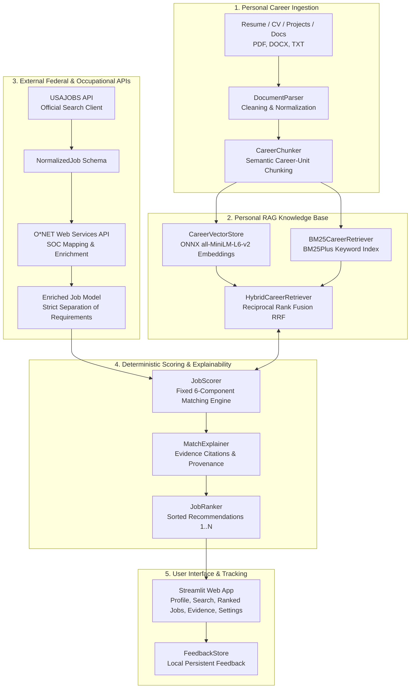

# Personal AI Job Search and Matching Application (MVP)

An evidence-grounded AI application designed to search, enrich, evaluate, rank, and explain current federal job postings against personal career documents without hallucinations or black-box score fabrication.

---

## 📌 Project Purpose

Job seekers often struggle with generic, keyword-matching job boards that fail to evaluate nuanced technical qualifications, distort job requirements, or produce arbitrary match scores.

This project delivers a **Personal AI Job Search and Matching MVP** that:
1. Ingests personal career documents (**PDF, DOCX, TXT**) and structures them into a **Personal RAG Knowledge Base** segmented by meaningful career units (work positions, academic projects, degrees, skills, certifications).
2. Searches live federal job announcements via the **USAJOBS API**.
3. Enriches job postings with occupational data from the **O*NET Web Services API**, strictly distinguishing between **Employer Requirements** and **O*NET Occupational Information**.
4. Uses a **Hybrid Retrieval Engine** combining **BM25 keyword search** (for exact technical tools like `PyTorch`, `SQL`, `Docker`, `BERT`) and **Dense Vector Similarity** (via ONNX `all-MiniLM-L6-v2`) fused via **Reciprocal Rank Fusion (RRF)**.
5. Calculates deterministic, transparent match scores using a **fixed 6-component human-designed matching model** (100% total) where components strictly sum to the overall score.
6. Provides complete **evidence provenance** for every qualification assessed (citing document, section, and chunk ID) or explicitly returning `"No evidence found."`
7. Enables interactive **Human Feedback** (`Interested`, `Good Match`, `Applied`, etc.) for local candidate tracking.

---

## 🏛️ System Architecture

The overall processing pipeline follows an evidence-grounded flow:

$$\text{Personal Career Data} \longrightarrow \text{Personal RAG} \longrightarrow \text{USAJOBS Retrieval} \longrightarrow \text{O*NET Enrichment} \longrightarrow \text{Hybrid Retrieval} \longrightarrow \text{Weighted Matching} \longrightarrow \text{Ranking} \longrightarrow \text{Evidence Explanation} \longrightarrow \text{Human Feedback}$$



---

## ⚖️ Fixed Weighted Matching Model (100% Total)

The scoring model strictly implements human-designed fixed weights locked in `config.py` and application logic. The AI/LLM is **never** permitted to alter these weights arbitrarily:

$$\text{Overall Score} = S_{\text{skills}} + S_{\text{experience}} + S_{\text{education}} + S_{\text{career\_interest}} + S_{\text{salary}} + S_{\text{job\_type}}$$

| Component | Weight | Max Points | Scoring Methodology & Evidence Source |
| :--- | :---: | :---: | :--- |
| **Skills** | **35%** | `35.0` | Evaluates required skills (70% weight = 24.5 pts) and preferred skills (30% weight = 10.5 pts) grounded against Personal RAG chunks. |
| **Experience** | **25%** | `25.0` | Evaluates domain relevance of past roles/projects (60%) and tenure duration (40%) against candidate work experience chunks. |
| **Education** | **15%** | `15.0` | Assesses degree level (BS/MS/PhD) and discipline match against candidate education chunks. |
| **Career Interest** | **15%** | `15.0` | Evaluates semantic alignment between target roles/goals and job responsibilities. |
| **Salary** | **5%** | `5.0` | **Soft preference:** Meeting or exceeding target salary earns full 5.0 pts. Lower salary scales smoothly ($\min(5, 5 \times \frac{\text{offered}}{\text{expected}})$); never an automatic rejection. |
| **Job Type** | **5%** | `5.0` | Alignment with employment schedule preference (Full-Time, Permanent). |
| **Location** | **0%** | `0.0` | **Excluded from numerical score** because candidate is geographically flexible (open to remote, hybrid, on-site, and relocation). |
| **TOTAL** | **100%** | `100.0` | **Mathematically Guaranteed:** Component scores strictly sum to the overall score. |

### 🛡️ Strict Guardrails
- **Mandatory Disqualification Flagging:** If an employer posting has a non-negotiable prerequisite that the candidate clearly lacks (e.g. an active Top Secret clearance or commercial pilot license), the system flags the job with a prominent warning while calculating the objective score.
- **Strict Separation of O*NET Data:** O*NET occupational data is strictly labeled as `O*NET OCCUPATIONAL INFORMATION` and stored in `onet_*` fields. It is **never** conflated with employer requirements.
- **Competitiveness vs. Requirements:** Missing employer requirements are displayed under **"Missing Job Requirements"**, while non-mandatory O*NET suggestions are displayed separately under **"Skills That Could Improve Competitiveness"**.
- **No Hallucination:** If candidate documents do not contain evidence for a requirement, the system outputs `"No evidence found."`

---

## 🧰 Technology Stack

- **Python 3.13 / 3.11+**
- **User Interface:** Streamlit
- **Data Validation:** Pydantic v2
- **Information Retrieval & RAG:**
  - `rank-bm25` (BM25Plus with custom technical tokenization and stop-word filtering)
  - `chromadb` & `scikit-learn` (Local dense embeddings and cosine similarity)
  - Local ONNX `all-MiniLM-L6-v2` (self-contained dense vector embeddings)
- **Document Parsing:** `pypdf`, `python-docx`
- **APIs:** USAJOBS API, O*NET Web Services API (with automatic fallback demonstration datasets)
- **Testing:** `pytest` (automated unit and end-to-end integration test suite)

---

## 🚀 Setup & Installation

### 1. Clone or Open the Repository
```bash
cd "your/directory/location"
```

### 2. Create and Activate Virtual Environment
```bash
python3 -m venv .venv
source .venv/bin/activate
```

### 3. Install Dependencies
```bash
pip install -r requirements.txt
```

---

## 🔑 Environment Configuration

Copy the `.env.example` template to create your `.env` file:
```bash
cp .env.example .env
```

Edit `.env` with your API credentials:
```ini
# USAJOBS API Credentials (register at https://developer.usajobs.gov/)
USAJOBS_API_KEY=your_usajobs_api_key_here
USAJOBS_USER_AGENT=your_email@example.com

# O*NET Web Services Credentials (register at https://services.onetcenter.org/)
ONET_API_KEY=your_onet_api_key_here
# Optional legacy Basic Auth if using username/password instead of an API key:
# ONET_USERNAME=
# ONET_PASSWORD=

# Application Configuration
APP_ENV=development
DATA_DIR=data
VECTOR_DB_DIR=data/vector_db
UPLOADS_DIR=data/uploads
EMBEDDING_MODEL=all-MiniLM-L6-v2
```

> [!NOTE]
> **Zero-Configuration Demonstration Mode:** If API credentials are not yet entered, the application automatically activates high-fidelity demonstration datasets for federal job opportunities and O*NET occupational taxonomy, allowing immediate testing without API key setup.

---

## 💻 Running the Application

Launch the Streamlit web application:
```bash
streamlit run app.py
```

The web browser will open to:
```
http://localhost:8501
```

---

## 🖥️ User Interface Overview

The Streamlit interface includes seven primary tabs:

1. **👤 Profile & Career Data:**
   - Upload personal career documents (**PDF, DOCX, TXT**).
   - One-click **"Load Sample Profile & Resume"** button for instant demonstration.
   - Configure target roles, career interests, salary expectation, experience years, and clearance.
   - Inspect indexed career chunks, metadata, and extracted technical skills.
2. **🔍 Job Search:**
   - Search USAJOBS by keyword/role, location, remote status, federal job series (GS-2210, GS-1560, etc.), and minimum salary.
   - One-click action to query USAJOBS, enrich with O*NET, and rank positions.
3. **🏆 Recommended Jobs:**
   - Displays ranked job postings ordered from highest match score to lowest.
   - Visual badges for overall score, component score summaries, and disqualification flags.
4. **🔬 Job Details & Evidence:**
   - Deep-dive match analysis for any selected job.
   - Direct link to official USAJOBS application portal.
   - Exact mathematical breakdown ($XX/35 + XX/25 + XX/15 + XX/15 + XX/5 + XX/5 = XX/100$).
   - Detailed citations for matched qualifications with source document, section, and chunk ID.
   - Separation of **Missing Job Requirements** from **Skills That Could Improve Competitiveness**.
   - Interactive **Human Feedback** form (`Interested`, `Good Match`, `Applied`, etc.) saved locally.
5. **📊 In-Demand Skills & Education Summary:**
   - Aggregates the most sought-after employer skills and O*NET technology tools across all retrieved jobs.
   - Summarizes education credential demand: degree level distribution (Ph.D. vs. Master's vs. Bachelor's) and top disciplines (Computer Science, Data Science, Math/Stats).
   - Interactive candidate skill alignment and gap analysis highlighting verified possessed skills vs. top high-value skill gaps.
6. **🔎 Personal RAG Explorer:**
   - Query your career database with arbitrary technical phrases.
   - Test BM25 keyword matching and vector similarity side-by-side with Reciprocal Rank Fusion.
7. **⚙️ Settings & System Status:**
   - Real-time API connection checks for USAJOBS and O*NET.
   - Documentation of fixed matching weights.
   - History log of candidate feedback.

---

## 🧪 Automated Testing

Run the comprehensive automated test suite with `pytest`:
```bash
pytest -v tests/
```

### Test Suite Coverage
- `tests/test_document_parser.py`: PDF, DOCX, and TXT parsing, text normalization, and semantic career chunking.
- `tests/test_hybrid_retriever.py`: BM25Plus exact technical keyword retrieval, vector cosine similarity, RRF fusion, and positive/negative evidence support gating.
- `tests/test_usajobs_service.py`: USAJOBS query parameters, schema normalization, missing fields handling, and fallback demo dataset.
- `tests/test_onet_service.py`: O*NET SOC code mapping, occupational details enrichment, and strict separation between employer requirements and O*NET data.
- `tests/test_scorer.py`: Mathematical proof that the 6 component scores strictly sum to the overall score ($XX/35 + XX/25 + XX/15 + XX/15 + XX/5 + XX/5 = XX/100$), soft salary scaling, and mandatory disqualifier flagging.
- `tests/test_feedback.py`: Human feedback CRUD operations and persistence in `data/feedback.json`.
- `tests/test_end_to_end.py`: End-to-end integration test validating all 15 MVP success criteria.

---

## 🔒 Security & Guardrails

- **No Secrets in Source Code:** API keys and credentials are exclusively loaded from `.env` via `python-dotenv`.
- **Git Security:** `.gitignore` strictly prevents `.env`, vector database files, user uploads, cache directories, and credentials from entering version control.
- **Local Cache Isolation:** Embedding cache directories are set within the workspace `.cache/` directory to adhere to secure sandbox boundaries.
- **Zero Hallucination:** Scoring is deterministic Python logic; the system never invents skills, experiences, or employer requirements.

---

## 📈 Known Limitations & Future Improvements

- **Current MVP Scope:** Evaluates single-candidate profiles at a time; future versions could support multi-user profile switching.
- **PDF Scanned Documents:** Relies on embedded PDF text layers; integrating OCR (e.g. Tesseract) could support scanned paper resumes.
- **Personalized Re-ranking:** User feedback (`Applied`, `Good Match`) is persisted locally in `data/feedback.json`. Future enhancements can use this feedback to train preference models (e.g. learning-to-rank) without compromising the transparency of the baseline scoring model.
